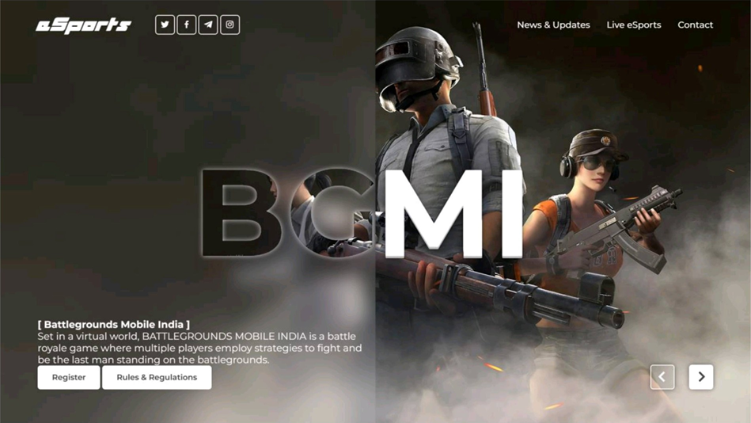
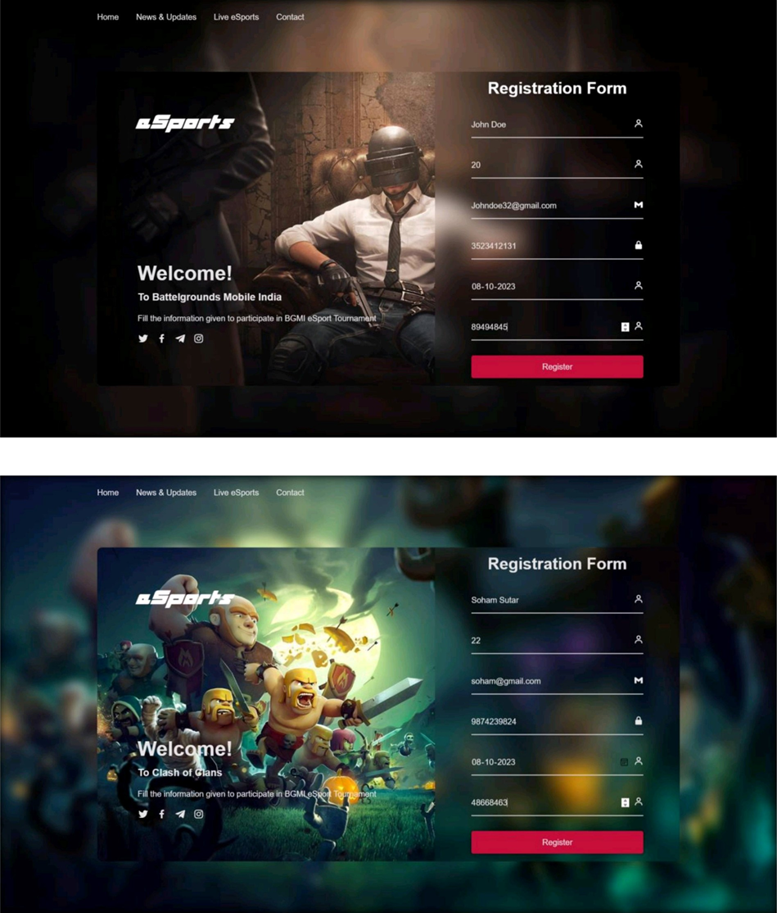
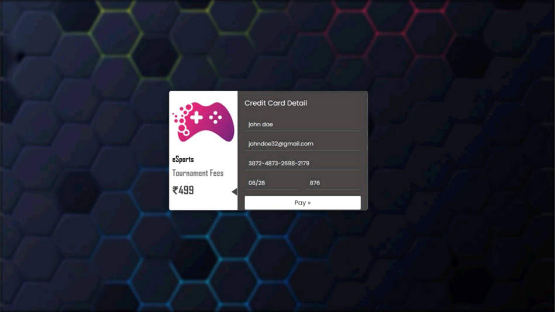
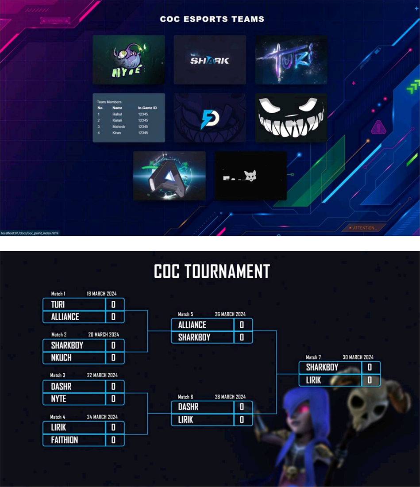
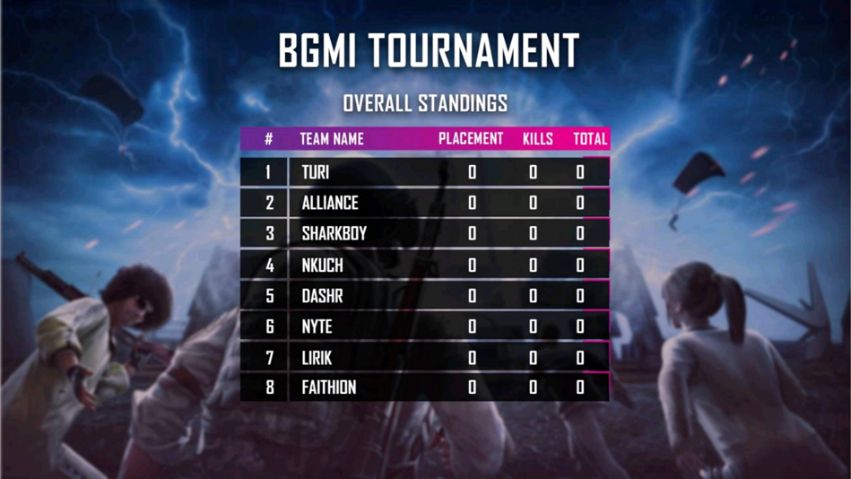

# 🎮 Esports Tournament Management System

This project is a web-based **Esports Tournament Registration &
Management System** that allows players, teams, and organizers to
participate in and manage esports tournaments. It supports multiple
popular games like BGMI, Clash of Clans, Free Fire, and Valorant, with
modules for registration, payments, schedules, and results.

------------------------------------------------------------------------

## 📂 Project Structure

    esports_project/
    │-- docs/
    │   ├── db_register.sql        # Database schema
    │   ├── connector.php          # Database connection
    │   ├── bgmi_regi_index.html   # BGMI registration page
    │   ├── coc_regi_index.html    # Clash of Clans registration page
    │   ├── free_pay_success_index.php  # Free Fire payment success page
    │   ├── contact_index.html     # Contact page
    │   ├── scripts & styles (CSS, JS)
    │   └── assets (images, videos, audio for UI/UX)

------------------------------------------------------------------------

## 🌟 Features

-   📝 **User & Team Registration** -- Players and teams can easily sign
    up for tournaments.\
-   💳 **Payment Integration** -- Secure payment gateway for tournament
    fees.\
-   📜 **Rules & Regulations** -- Game-wise rules and eligibility.\
-   📅 **Match Scheduling** -- Automated notifications and schedule
    updates.\
-   🏆 **Leaderboard & Rankings** -- Displays top teams and players.\
-   📡 **Live Updates** -- Real-time scores, stats, and optional
    streaming integration.\
-   👥 **Community Building** -- Platform for gamers to connect and
    compete.\
-   📩 **Email Notifications** -- Confirmation emails and error alerts
    via PHPMailer.

------------------------------------------------------------------------

## 🛠 Tech Stack

-   **Frontend:** HTML, CSS, JavaScript\
-   **Backend:** PHP\
-   **Database:** MySQL (`db_register.sql`)\
-   **Server:** XAMPP (Apache + MySQL)\
-   **Email Service:** PHPMailer\
-   **Tools:** Visual Studio Code, phpMyAdmin

------------------------------------------------------------------------

## ⚡ Installation & Setup

1.  Clone the repository:

    ``` bash
    git clone https://github.com/your-username/esports-project.git
    cd esports_project
    ```

2.  Move project folder into XAMPP `htdocs`:

        C:\xampp\htdocs\esports_project

3.  Import the database:

    -   Open <http://localhost/phpmyadmin>\
    -   Create database: `esports_db`\
    -   Import `docs/db_register.sql`

4.  Update DB connection in `connector.php`:

    ``` php
    $servername = "localhost";
    $username   = "root";
    $password   = "";
    $dbname     = "esports_db";
    ```

5.  Start Apache & MySQL in XAMPP.\

6.  Run the project in browser:

        http://localhost/esports_project/docs/bgmi_regi_index.html

------------------------------------------------------------------------

## 📸 Screenshots

### 🏠 Homepage




### 📝 Registration Page

![Registration]](image-3.png)


### 💳 Payment Page


(image-5.png)

### 📅 Schedule & Teams

(image-7.png)

### 📊 Leaderboard




## 📂 Database

The project uses MySQL with following main tables: - `bgmi_register` --
BGMI player/team registration\
- `coc_register` -- Clash of Clans registration\
- `free_register` -- Free Fire registration\
- `valo_register` -- Valorant registration\
- `tbl_register` -- Generic registration table

------------------------------------------------------------------------

## 🔮 Future Enhancements

-   📱 Mobile app for registrations & live updates\
-   📡 Live streaming integration (Twitch/YouTube)\
-   🔔 Push notifications for match alerts\
-   🏆 AI-based matchmaking system\
-   🌍 Multi-language support

------------------------------------------------------------------------

## 👩‍💻 Contributors

-   Dilip Choudhary\
-   Soham Sutar


